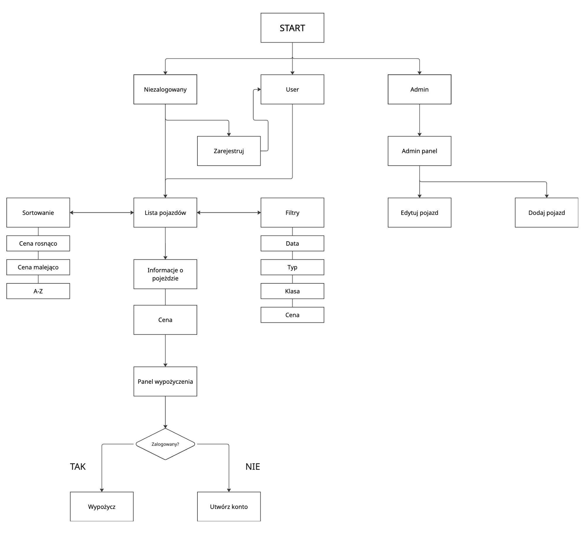

# Wypożyczalnia Samochodów - Grupa 9 



---

## 1. Opis projektu i jego funkcjonalności

Projekt to aplikacja terminalowa (TUI) symulująca system wypożyczalni samochodów, napisana w języku C++17. Została wyposażona w nowoczesny i interaktywny interfejs użytkownika oparty o bibliotekę **FTXUI** oraz system zapisu i odczytu danych wykorzystujący **nlohmann/json**.

**Główne funkcjonalności:**  
- **System logowania i uwierzytelniania:** Obsługa kont użytkowników z podziałem na uprawnienia (np. administrator, klient).  
- **Panel Administratora:** Dedykowany moduł pozwalający na zarządzanie bazą pojazdów, zamówieniami oraz konfiguracją systemu.  
- **Baza pojazdów:** Przechowywanie szczegółowych informacji o dostępnych samochodach, ich statusie i specyfikacji.  
- **System zamówień i kalendarz:** Procesowanie wypożyczeń, sprawdzanie dostępności pojazdów w wybranym terminie za pomocą interaktywnego kalendarza.  
- **Interaktywny interfejs (TUI):** Nawigacja klawiaturą i myszką, dynamiczne widoki (Rightpanel, widoki zamówień) oraz płynne przełączanie aktywnych elementów (focusów).

---

## 2. Instrukcja kompilacji i uruchomienia

Projekt korzysta z autorskiego systemu budowania opartego na `nob.h`, co pozwala na całkowite pominięcie konfiguracji CMake. Skrypt automatycznie pobiera pliki `.cpp` z katalogu `src/` (oraz niezbędne pliki bibliotek) i odtwarza strukturę w katalogu `build/obj/`.

Aby skompilować projekt, system operacyjny musi posiadać kompilator C/C++ (np. `clang++` lub `g++`). Należy upewnić się, że ustawiono odpowiednie zmienne środowiskowe `CXX`.

### Uruchomienie na Linux / macOS
```sh
./build.sh [flag] [action] [mode]
```

### Uruchomienie na Windows
```bat
.\build.bat [flag] [action] [mode]
```

**Flagi (`[flag]`):** `-jX` – Flaga określająca liczbę wątków (X) podczas kompilacji (np. `-j8`), co znacznie przyspiesza proces budowania.  

**Akcja (`[action]`):**  
`build` *(domyślnie)* – kompiluje i linkuje projekt (tylko zmienione pliki), tworząc plik wykonywalny w folderze `build/`.  
`run` – kompiluje projekt (jeśli konieczne) i natychmiast go uruchamia. Wszelkie parametry dopisane po `[mode]` są przekazywane bezpośrednio do programu.
`clean` – czyści katalog obiektowy `build/obj/` oraz usuwa plik wykonywalny.  

**Tryb (`[mode]`):**
`debug` *(domyślnie)* – kompiluje program z flagami debugowania (brak optymalizacji, włączone informacje o debugowaniu i ostrzeżenia).
`release` – pomija flagi debugowania i stosuje pełną optymalizację poziomu `-O3`.

---

## 3. Informacje o autorach i ich wkładzie

Prace nad projektem zostały podzielone między członków zespołu, aby zmaksymalizować efektywność.

**Marcin Madanowicz**
Panel Administratora (`AdminPanel.cpp`).
Testy interfejsu oraz UX.

**Oskar Strzelecki**
System logowania i autoryzacji użytkowników.
Model danych pojazdów (`Vehicle`, `Car`).
Projekt i wdrożenie systemu danych (współpraca z Jakubem).
Autorski system budowania kompilujący projekt (`nob.h`).
Bug-fixy, łatki bezpieczeństwa i stabilności.

**Sandra Wróblewska**
Główne elementy interfejsu (TUI): `Calendar`, `Configuration`, widoki systemu rezerwacji (`Order`), `Postcard`, `Rightpanel` oraz główny `view`.
Niezbędne zmiany architektoniczne umożliwiające poprawną implementację poszczególnych widoków interfejsu.

**Jakub Zarębski**
Logika biznesowa systemu rezerwacji (`Order`).
Baza pojazdów.
Projekt i wdrożenie systemu danych (współpraca z Oskarem).

**Wykorzystane biblioteki:**  
**FTXUI** - do zaawansowanego interfejsu terminalowego.  
**nlohmann/json** - do zapisu i odczytu bazy danych (JSON).  

---

## 4. Sprawozdanie z zajęć projektowych

**Cel projektu:**
Zadaniem zespołu było zaprojektowanie, zaimplementowanie i przetestowanie systemu wypożyczalni samochodów, z wykorzystaniem paradygmatów programowania obiektowego (OOP) w języku C++. Zespół podjął ambitną decyzję o stworzeniu aplikacji konsolowej opartej o interfejs tekstowy (TUI), co miało na celu poprawę ergonomii użytkowania i zgłębienie zaawansowanych bibliotek (FTXUI).

**Przebieg prac i realizacja:**  

**Decyzje architektoniczne:** Projekt oparto na architekturze MVC, celowo rozdzielając logikę od widoków. Do przechowywania danych wybrano lekki format JSON, gwarantujący prostotę i niezawodność, który obsłużono biblioteką `nlohmann/json`. Zrezygnowano ze standardowego systemu CMake na rzecz własnego systemu budującego na bazie `nob.h`.  

**Cykl życia projektu:** Po zaplanowaniu wymagań i wytypowaniu najważniejszych części (Pojazd, Użytkownik, Zamówienie), zespół podzielił zadania. Warstwą zarządzania danymi i logiką biznesową zajęli się wspólnie Oskar i Jakub. Interfejs z wieloma specjalistycznymi widokami to głównie zasługa Sandry, natomiast integracją panelu administratora zajął się Marcin.  

**Zarządzanie wyzwaniami:** Zastosowanie biblioteki FTXUI wymagało opanowania mechanizmów propagacji zdarzeń klawiatury i dynamicznego odświeżania okien. Istotnym problemem podczas rozwoju było zachowanie spójności stanów między danymi w pamięci i trwałym zapisem w plikach JSON.  

**Zakończenie i integracja:** Ostatnia faza opierała się na testach (od zalogowania klienta, przez rezerwację za pomocą kalendarza, aż do modyfikacji stanu przez administratora) oraz bug-fixingu (koordynowanym przez Marcina i Oskara).  

**Podsumowanie:**
Zajęcia projektowe zaowocowały stworzeniem kompletnego, złożonego oprogramowania. Zespół poprawnie zastosował wzorce projektowe, zaawansowane biblioteki i wykazał się bardzo dobrą współpracą. Powstała aplikacja jest funkcjonalna i stanowi przykład nowoczesnej aplikacji terminalowej z własnym, zoptymalizowanym systemem kompilacji.
