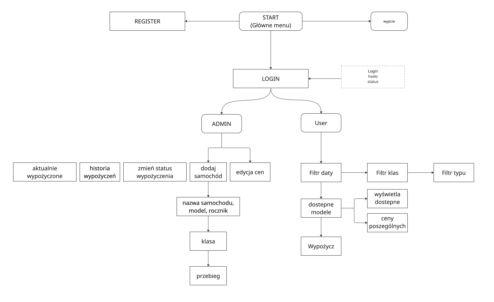

# Grupa 9 - Wypożyczalnia samochodów

---

## Build

Projekt korzysta z customowego systemu budowania opertego na `nob.h`. Pozwala to pominąc grzebanie w CMake.
Skrypt sam pobiera pliki `.cpp` z katalogu `src/` i odtwarza strukturę w `build/obj/`

### Linux / macOS
```sh
./build.sh <action> <mode>
```
### Windows 
TBD

### Parametry 

**action:**
- `build` - domyślnie, kompiluje i linkuje projekt, tworzac plik wykonywalny w folderze `build/`
- `run` - buduje projekt (jeśli są zmiany) i od razu uruchamia plik wykonywalny. Wszystkie parametry podane po `<mode>` zosataną bezpośrednio przekazane
do programu
- `clean` - czyści wszystko z `build/obj/` oraz sam plik wykonywalny

**mode:**
- `debug` - domyślnie, kompiluje program wraz z flagami do debugowania i wyswietlania ostrzeżeń, a także nie stosuje optymaliacji
- `release` - pomija flagi debugowania, ostrzeżenia, a także stosuje optymalilzacje na najwyższym poziomie

---

## Diagram programu


## Skład zespołu
- Marcin Madanowicz
- Oskar Strzelecki
- Sandra Wróblewska
- Jakub Zarębski
